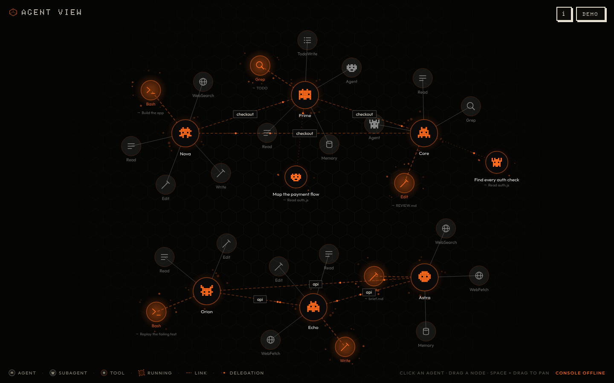
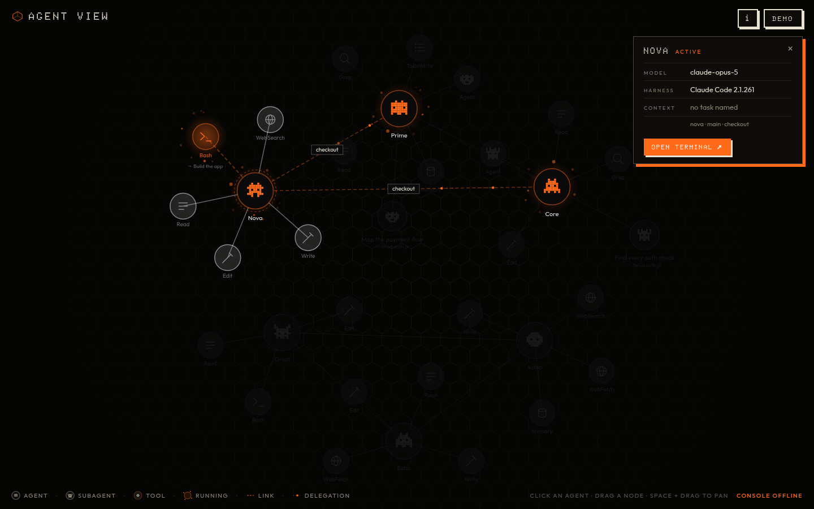
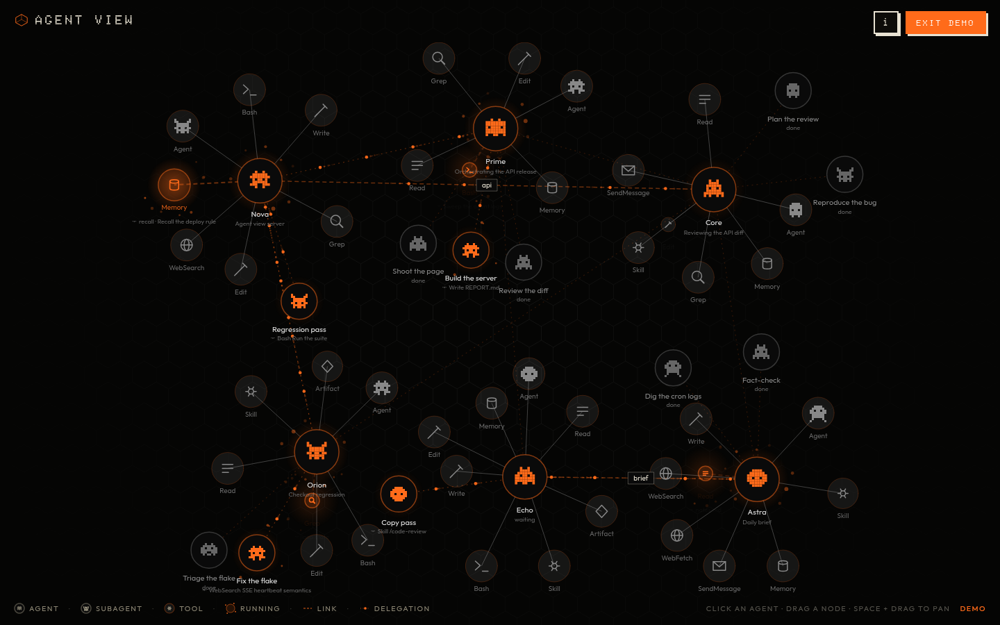
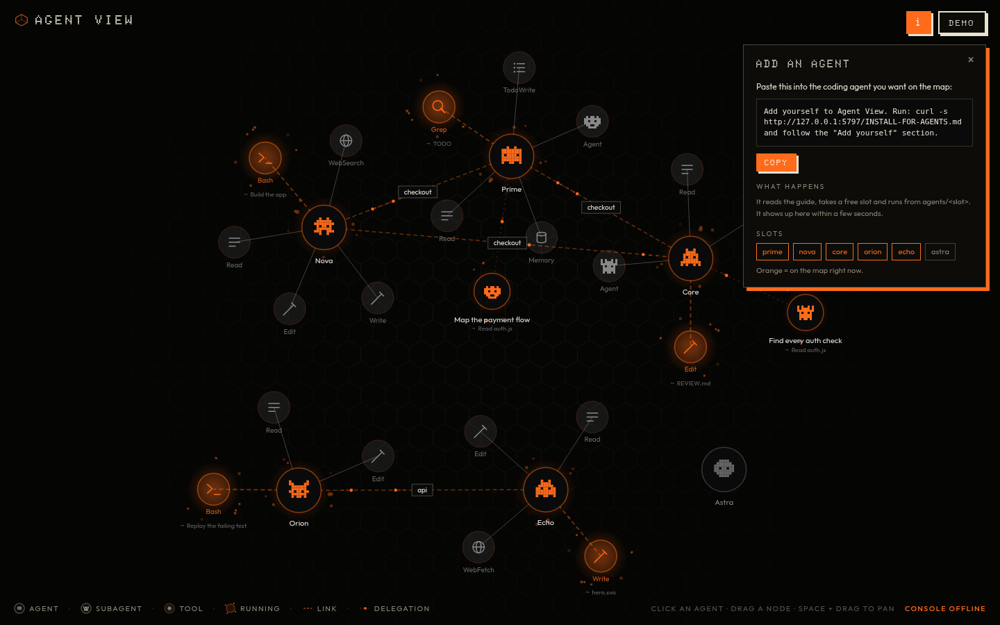

# Agent View

A live map of what your Claude Code agents are doing right now.

Each agent is a node. Every tool it used recently hangs off it as a smaller node, and the tool it is using this second glows orange. Subagents show up as their own nodes. Click an agent to see its model, harness and current task.

- One `server.js`, one `index.html`
- Node 22+, **no dependencies**, no build step
- Read-only: it binds `127.0.0.1`, only serves GET, and never writes anything



*Live, with no status feed connected. The legend reads CONSOLE OFFLINE, and agents are lit from their transcripts.*

| Click an agent | DEMO mode |
|---|---|
|  |  |

## Quick start

```bash
git clone <this repo> agentview
cd agentview
node server.js
```

Open **http://127.0.0.1:5076**. Click **DEMO** (top right) to watch a scripted fleet.

## How an agent shows up

Agent View has six agent slots: `prime`, `nova`, `core`, `orion`, `echo` and `astra`.

To put an agent on the map, **start its Claude Code session from a folder named `agents/<id>`**:

```bash
mkdir -p ~/work/agents/nova
cd ~/work/agents/nova
claude
```

Claude Code saves that session's transcript under `~/.claude/projects/-…-agents-nova/`, and Agent View picks it up within a few seconds.

**The easy way:** click **i** (top right), press **COPY**, and paste the line into the agent you want to add. It fetches the guide from the running Agent View, takes a free slot, and appears on the map. Free slots are grey, and slots on the map are orange.



**Having a coding agent install this?** Tell it: *"Read INSTALL-FOR-AGENTS.md and install Agent View."*

## Settings

Every setting is an environment variable, and all of them are optional.

| Variable | Default | What it does |
|---|---|---|
| `PORT` | `5076` | The port to listen on |
| `TRANSCRIPTS_DIR` | `~/.claude/projects` | Where Claude Code keeps its transcripts |
| `CONSOLE_URL` | `http://127.0.0.1:5050/api/agent-status` | Optional status feed that supplies each agent's status and task. If nothing answers, an agent counts as active while its transcript was written in the last 15 minutes, and the legend reads CONSOLE OFFLINE. |
| `PROJECTS_ROOT` | `~/projects` | If two agents work inside the same folder here, a LINK line connects them |
| `BRAIN_POOL` | `~/.agent-memory` | Optional memory folder. Reads from it are drawn as a Memory node |

```bash
PORT=5076 TRANSCRIPTS_DIR="$HOME/.claude/projects" node server.js
```

## Endpoints

| Path | Returns |
|---|---|
| `/` | The page |
| `/api/agents` | A JSON snapshot of every agent |
| `/api/stream` | Server-sent events, sent on every change |
| `/api/health` | `{ ok, transcripts, console, … }` |
| `/INSTALL-FOR-AGENTS.md` | The agent guide, which the **i** panel's copied line fetches |

## Privacy

Transcripts contain full commands and file contents. Only a tool's **name** and a short, cleaned-up label ever leave the server:
- For Bash, that is the call's `description`, never the command.
- For WebFetch, it is the hostname only.
- For file tools, it is the file name only.
- A subagent's prompt never leaves the server.

## Companion app

On an agent's card, **OPEN TERMINAL** opens `http://<same host>:5075/?agent=<id>`, which is the Agent Terminal app. If you don't run it, change `TERM_PORT` in `index.html`.

MIT licensed.
